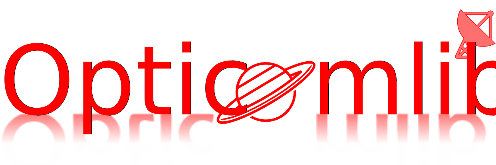

[](https://pypi.org/project/opticomlib/)
[](https://armando-palacio.github.io/opticomlib)
[](https://github.com/armando-palacio/opticomlib.git)

Opticomlib is an open source Python package for optical communications research. It is oriented to engineers who want to simulate optical communication systems using Python. The package provide `binary_sequence`, `electrical_signal`, `optical_signal`, and `eye` objects with methods for signal processing and visualization integrated with `numpy`, `scipy`, and `matplotlib` libraries for frendly use. The package also provide a set of electro-optic devices as `MZM`, `FIBER`, `PD`, `EDFA`, and much more. 

* **Opticomlib Documentation:** https://armando-palacio.github.io/opticomlib
* **Opticomlib Repository:**  https://github.com/armando-palacio/opticomlib.git
* **Bug reports:**  https://github.com/armando-palacio/opticomlib/issues
* **Contributing:** [CONTRIBUTING.md](CONTRIBUTING.md)

## Features

* **Electro-optic devices:** most common electro-optic devices are implemented in the package (`opticomlib.devices`):
  * `PRBS`: Pseudo Random Binary Sequence Generator
  * `DAC`: Digital to Analog Converter
  * `ADC`: Analog to Digital Converter
  * `PM`: Phase Modulator
  * `MZM`: Mach-Zehnder Modulator (intensity modulator)
  * `FIBER`: Optical Fiber
  * `DM`: Pure Dispersive Medium
  * `PD`: Photodetector
  * `EDFA`: Erbium Doped Fiber Amplifier
  * `SAMPLER`: electrical sampler
  * `LPF`: Low Pass Filter
  * `BPF`: Band Pass Filter
  * `GET_EYE`: Eye Diagram parameters estimator
  * `FBG`: Fiber Bragg Grating
  * ... and more in the future
* **Modulation formats:** modulations are implemented in separate modules, with their own functionalities:
  * `OOK`: On-Off Keying (`opticomlib.ook`)
  * `PPM`: Pulse Position Modulation (`opticomlib.ppm`)
  * ... and more in the future
* **Objects types:** methods for signal processing and visualization are integrated in the following objects:
  * `binary_sequence`: object for binary sequences
  * `electrical_signal`: object for electrical signals
  * `optical_signal`: object for optical signals
  * `eye`: object for eye diagrams

* **Laboratory utilities:** framework for communication with laboratory equipment and post-processing of data (`opticomlib.lab`).

## Installation

You can install opticomlib using pip:

```bash
pip install opticomlib
```

or from source code:

```bash
pip install git+https://github.com/armando-palacio/opticomlib.git
```

## License

This project is licensed under the terms of the [MIT license](LICENSE.md).

## Contact

If you wish to contact me you can do so at <armandopr3009@gmail.com>.
