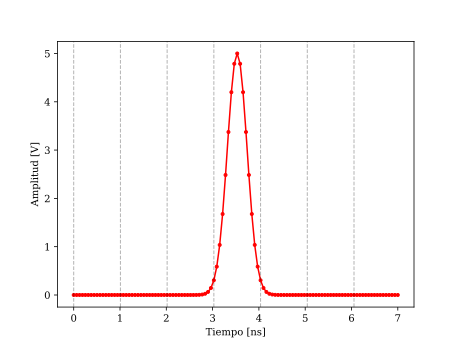

Installation
------------

To use Opticomlib, first install it using pip:

.. code-block:: console

   (.venv) $ pip install opticomlib

Usage
-----

To use Opticomlib, you have to import the modules you need (as devices, ook, ppm, etc) and use them in your code. 
Also, you need to import ``gv`` variable from ``opticomlib.typing`` or ``opticomlib.devices`` to set global variables.

Here is an example of how to use Opticomlib to generate a gaussian pulse with a given width and amplitude using ``DAC`` device:

.. code-block:: python

   from opticomlib.devices import DAC, gv

   # Set the global variables
   gv(sps=16, R=1e9) # set samples per slot and slot rate

   # Create a gaussian pulse
   pulse = DAC('0,0,0,1,0,0,0', pulse_shape='gaussian', T=8, Vout=5) # create a gaussian pulse with a width of 8 samples and an amplitude of 5V

   # for plotting
   pulse.plot('r.-').show()

